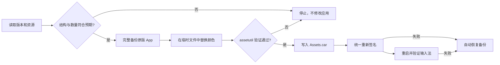

# WeType Accent

通过一次 `npx` 命令自定义 macOS 微信输入法候选窗的重点色，让默认绿色变成系统蓝、紫色、粉色或任意你喜欢的颜色。

[](https://github.com/chen86860/wetype-accent/releases/latest)
[](https://github.com/chen86860/wetype-accent/actions/workflows/ci.yml)
[](LICENSE)

> [!WARNING]
> 这是非官方社区工具，与腾讯无关。请只从本仓库或正式 npm 包运行脚本。应用补丁后，微信输入法原有的开发者签名会被替换为本机临时签名；更新微信输入法前，请先使用本工具恢复原版。

## 功能

- 支持任意 `#RRGGBB` 颜色
- 通过 `npx` 临时运行，无需下载或全局安装 CLI
- 自动生成深色模式、次级色和浅色背景
- 支持分别指定每一种颜色
- 修改前完整备份微信输入法
- 严格校验颜色记录和资源文件
- 修改、签名或重启失败时自动回滚
- 支持状态检查、故障诊断和一键恢复
- 不分发腾讯的应用、二进制文件或资源文件

## 兼容性

| 项目 | 要求 |
| --- | --- |
| 微信输入法 | `>= 2.2.0`，且资源结构符合预期 |
| macOS | `>= 13` |
| Node.js | `>= 18` |

新版本微信输入法如果改变了资源结构，工具会在写入前停止，不会强行修改应用。

## 快速开始

### 1. 直接运行

无需安装。打开“终端”，以 macOS 系统蓝 `#007AFF` 为例直接执行：

```sh
npx --yes github:chen86860/wetype-accent#v0.2.0 --color '#007AFF'
```

脚本会先显示配色和操作提示，确认后才通过系统 `sudo` 请求管理员权限。请勿使用 `sudo npx`。

### 2. 预览颜色

以 macOS 系统蓝 `#007AFF` 为例：

```sh
npx --yes github:chen86860/wetype-accent#v0.2.0 preview --color '#007AFF'
```

这一步只显示将要使用的配色，不会修改微信输入法。

### 3. 应用颜色

```sh
npx --yes github:chen86860/wetype-accent#v0.2.0 apply --color '#007AFF'
```

工具会先完整备份微信输入法，再修改资源、重新签名并重启输入法。

## 常用颜色

| 颜色 | 色值 | 命令 |
| --- | --- | --- |
| macOS 蓝 | `#007AFF` | `--color '#007AFF'` |
| 紫色 | `#BF5AF2` | `--color '#BF5AF2'` |
| 粉色 | `#FF375F` | `--color '#FF375F'` |
| 橙色 | `#FF9F0A` | `--color '#FF9F0A'` |

需要完全控制深色模式和辅助颜色时，可以分别指定：

```sh
npx --yes github:chen86860/wetype-accent#v0.2.0 apply \
  --color '#BF5AF2' \
  --dark '#CC7AFF' \
  --secondary '#CF86F7' \
  --background '#F7EEFC'
```

## 检查与恢复

查看当前状态：

```sh
npx --yes github:chen86860/wetype-accent#v0.2.0 status
```

检查资源、代码签名和运行状态：

```sh
npx --yes github:chen86860/wetype-accent#v0.2.0 doctor
```

恢复修改前的腾讯原版应用：

```sh
npx --yes github:chen86860/wetype-accent#v0.2.0 restore
```

自动化调用时可以添加 `--yes` 跳过确认。使用 `--app /path/to/WeType.app` 可以检查另一份应用副本。`npx` 只把脚本临时放入 npm 缓存，不会安装全局命令或后台组件。

## 从源码运行

项目不依赖第三方 npm 包：

```sh
git clone https://github.com/chen86860/wetype-accent.git
cd wetype-accent
npm ci
node bin/wetype-accent.mjs preview --color '#007AFF'
```

## 工作原理

### 颜色保存在哪里

微信输入法候选窗的颜色不是普通 PNG 图片，也不在配置文件中，而是编译在 CoreUI 资源目录 `Assets.car` 里：

```text
/Library/Input Methods/WeType.app/Contents/Resources/Assets.car
```

其中与候选窗重点色有关的是 `bc16`、`bg02`、`bg03` 和 `bg04`。同一个颜色可能分别存在于浅色、深色和通用外观中，因此工具实际执行 6 条替换规则，共匹配 11 处记录：

| 资源记录 | 原始颜色 | 用途 | 预期数量 |
| --- | --- | --- | ---: |
| `bc16` 浅色/通用 | `#16AC66` | 主重点色 | 2 |
| `bc16` 深色 | `#00D48E` | 深色重点色 | 1 |
| `bg02` 浅色/通用 | `#E8F7F0` | 浅色背景 | 2 |
| `bg03` 浅色/通用 | `#00B176` | 主重点色 | 2 |
| `bg03` 深色 | `#00A86F` | 深色重点色 | 1 |
| `bg04` 全部外观 | `#23C891` | 次级重点色 | 3 |

### 如何替换颜色

`Assets.car` 中这些 RGBA 颜色的每个通道都以 `0...1` 范围的 64 位浮点数保存，并采用小端字节序。一个颜色由 4 个通道组成，所以对应连续 32 字节：

```text
R/255 → Float64 little-endian
G/255 → Float64 little-endian
B/255 → Float64 little-endian
A/255 → Float64 little-endian
```

Node 脚本使用 `Buffer.writeDoubleLE` 把原始颜色和目标颜色转换成相同的 32 字节格式，然后进行精确匹配和等长替换。只有每条规则的匹配数量与上表完全一致时才会继续；少一处或多一处都会停止，因此不会靠模糊搜索修改未知数据。

如果只提供一个主颜色，其他颜色会自动生成：

- 深色重点色：主颜色向白色混合 8%。
- 次级重点色：主颜色向白色混合 25%。
- 浅色背景：主颜色向白色混合 90%。

例如输入 `#007AFF`，默认会得到：

| 用途 | 颜色 |
| --- | --- |
| 主重点色 | `#007AFF` |
| 深色重点色 | `#1485FF` |
| 次级重点色 | `#409BFF` |
| 浅色背景 | `#E6F2FF` |

这些自动结果都可以通过 `--dark`、`--secondary` 和 `--background` 单独覆盖。

### 安全处理流程



具体保护步骤如下：

1. 检查微信输入法版本和颜色记录数量。
2. 完整备份原始 `.app`，并记录原始资源的 SHA-256。
3. 先在临时文件中生成补丁，不直接试写已安装的资源。
4. 使用 Apple `assetutil` 验证补丁后的 CoreUI 资源目录。
5. 写入后再次验证应用及其内嵌代码的签名。
6. 只重启当前登录用户的微信输入法进程并确认新进程正常运行。
7. 写入、签名或运行验证失败时自动恢复完整备份。

### 为什么需要重新签名

`Assets.car` 属于应用签名覆盖范围，修改任意字节都会使腾讯原有签名失效。工具使用以下方式对主应用和内嵌代码进行一致的本机临时签名：

```sh
codesign --force --deep --sign - \
  --preserve-metadata=identifier,entitlements \
  "/Library/Input Methods/WeType.app"
```

`--deep` 用于避免主应用与内嵌框架签名身份不一致；Bundle Identifier 和原有权限声明会被保留。腾讯签名的原版应用仍完整保存在备份目录中，可以随时通过 `restore` 恢复。

本工具不会修改微信输入法设置窗口中的 Flutter 绿色渐变。

## 备份与更新

首次修改时，完整备份保存在：

```text
/Library/Application Support/WeTypeAccent/Backups/
```

由于修改资源会改变应用签名，更新微信输入法前建议先运行：

```sh
npx --yes github:chen86860/wetype-accent#v0.2.0 restore
```

然后通过官方安装程序更新，再重新应用颜色。如果新版本资源结构不兼容，工具会拒绝修改并显示错误。

## 安全与隐私

- 所有操作均在本机完成，不会发送网络请求。
- 脚本本身先以普通用户运行，只有 `apply` 和 `restore` 的写入阶段才会自行请求 `sudo`。
- 不安装后台服务、守护进程或常驻的特权组件。
- 不依赖第三方 npm 运行时包，发布包只包含单个 Node 脚本、README 和许可证。
- GitHub Actions 会检查测试结果和 npm 包内容；请固定版本运行，不建议长期使用 `#main`。

## 开发与贡献

```sh
npm ci
npm run check
node bin/wetype-accent.mjs preview --color '#007AFF'
```

欢迎提交 Issue 或 Pull Request。新增微信输入法版本兼容性时，请不要提交腾讯的 `Assets.car`、应用包或其他受版权保护的文件。

## 许可证

项目采用 [MIT License](LICENSE)。“WeType”和“微信输入法”是其各自所有者的商标。
